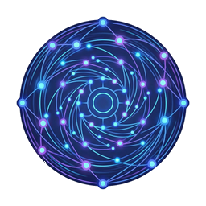

  
  <h1>Flywheel Geometry</h1>
  
<strong>Geodesic retrieval for personal vaults.</strong>

Nobody designed the hexagon into a snowflake — the physics doesn't permit anything else. Recent interpretability work shows neural networks across architectures encode meaning on curved manifolds: helices, circumplexes, shells ([Lubana et al., 2025–2026](https://www.youtube.com/watch?v=F9eEYWX64ZA); [@slashreboot, 2026](https://doi.org/10.5281/ZENODO.18176077)). Different architectures, different training data, similar internal geometry. Cosine similarity cuts through the void between those shapes. Geodesic retrieval follows the curve.

This repo is an in-progress experiment to test whether geodesic proximity beats cosine on cross-domain bridge-finding for personal knowledge bases.

---

## How this slots in

Flywheel Geometry is an **extension library for [flywheel-memory](https://github.com/velvetmonkey/flywheel-memory)** — the local-first MCP server that turns an Obsidian vault into safe AI memory. Today flywheel-memory ships hybrid BM25 + semantic search via Reciprocal Rank Fusion. Flywheel Geometry tests a third retrieval mode: geodesic proximity on the manifold the model already encodes. If the experiment lands, it ships as an optional index layer alongside cosine — same MCP surface, an extra search axis.

Part of the [Flywheel](https://github.com/velvetmonkey) suite:

- **[flywheel-memory](https://github.com/velvetmonkey/flywheel-memory)** — local-first MCP server, hybrid search, knowledge graph (this repo's host)
- **[flywheel-crank](https://github.com/velvetmonkey/flywheel-crank)** — Obsidian plugin: graph sidebar, vault health, semantic search UI
- **[flywheel-ideas](https://github.com/velvetmonkey/flywheel-ideas)** — falsifiable decision ledger with multi-model AI council dissent
- **flywheel-geometry** *(this repo)* — geodesic retrieval, in-progress

---

## The Problem

Standard retrieval measures cosine similarity between embedding vectors — linear distance in high-dimensional space. But concepts aren't encoded linearly. Neural networks encode meaning as curved manifolds: hue wheels, temporal spirals, helices, emotional circumplexes.

Steering linearly between two concepts cuts through the void where no valid meaning exists. The model becomes incoherent. Cosine similarity does the same to retrieval — it measures distance through regions that don't correspond to real semantic relationships.

Sparse autoencoders (SAEs) tile the manifold into fragments. They shatter the helix into disconnected shards. You get pieces of the shape, not the shape itself.

---

## The Solution

Flywheel Geometry captures **manifold coordinates** for each note — not just embedding vectors. Geometric position in the model's representational space. Then queries by geodesic proximity: distance *along the curve*, not across the void.

The bet: cross-domain bridge finding. Notes from different domains — horse training, AI architecture, finance, philosophy — that are geometrically adjacent surface together. No shared keywords. No explicit links. Just proximity on the manifold the model already encodes.

Whether this actually beats strong embedding retrieval is an open empirical question. See **How we'll know this works** below.

---

## How It Works

**Probing method** (via [@slashreboot](https://x.com/slashreboot)):
A single message asks the model to introspect its own embedding space and return 3D coordinates (x,y,z) from a fixed central anchor. No activation extraction. No UMAP pipeline. The model self-reports its geometry. Coordinates are stable across runs and across models. Stored alongside standard embeddings.

**Causal filter** (via Geiger et al. / Goodfire):
Not all geometry is real. Counterfactual pairs are generated for each concept, then DAS (Distributed Alignment Search) identifies causally efficacious subspaces — those that actually drive meaning, not just correlate with it. Only those coordinates are stored.

**Retrieval**:
Query by geodesic proximity on the manifold, not cosine similarity on flat vectors. Surface notes from the neighbourhood of your current thinking, across all domains.

---

## How we'll know this works

We're not assuming geodesic retrieval beats cosine — we're testing it. On a held-out set of 30 cross-domain queries against a 500-note vault, blind-rated top-5 results need to show ≥20% precision gain over **two** baselines:

1. Voyage-3 + LLM rerank.
2. Voyage-3 + LLM rerank where the LLM is allowed to generate bridge rationales for each candidate.

The second baseline is the one that distinguishes retrieval from presentation. If raters prefer rationale-augmented embeddings at equal or higher rates, the manifold "effect" is the LLM explaining adjacency, not the geometry surfacing it.

Results — confirming or refuting — get published here.

A separate falsifier targets the introspective probe itself: extract activations via TransformerLens for the same concepts, compare to self-reported coordinates under adversarial controls (false anchors, fake coordinate frames, synthetic concept domains). If self-report tracks activation-derived relational structure, the probe is measurement-grade. If it tracks the prompt's framing instead, the project pivots to direct activation extraction.

### Tracked through [flywheel-ideas](https://github.com/velvetmonkey/flywheel-ideas)

The project's central bets are registered as falsifiable assumptions in the [flywheel-ideas](https://github.com/velvetmonkey/flywheel-ideas) decision ledger — the sibling project built for exactly this shape of work. Each assumption carries a falsifier and a resolution criterion; multi-model AI council dissent is logged at registration; outcomes (confirm / refute) propagate to dependent claims when experiments resolve.

The currently tracked assumptions:

1. **Self-reported (x,y,z) coordinates correspond to actual activation geometry**, not interpretability-discourse priors. *Falsifier:* TransformerLens activation extraction + adversarial controls described above.
2. **Activation-derived geometry contains retrieval-useful structure that strong embeddings miss.** *Falsifier:* ≥20% precision@5 lift on 30 blind cross-domain queries vs Voyage-3 + LLM rerank.
3. **Coordinate stability across runs is measurement-grade**, not stable narrative priors. *Falsifier:* adversarial replication with false anchors and synthetic concept domains.
4. **Manifold proximity outperforms bridge-tension** (high embedding distance × high relational similarity) on cross-domain bridges. *Falsifier:* head-to-head on the same query corpus.
5. **Human-rated bridge value is not explained by generic embedding similarity + LLM rationale generation.** *Falsifier:* baseline 2 above — if raters prefer rationale-augmented embeddings at equal or higher rates, the manifold effect is presentation, not retrieval.

If 5 refutes, the project pivots — and the public pivot post is the launch. Watching your own thesis fail in the open is the strongest brand outcome the bet can produce.

---

## Theoretical Foundation

- **Cross-architecture convergence** — Gemma, Llama, and GPT independently develop similar geometric structures (hue wheels, temporal helices, emotional circumplexes). *([Matthew (@slashreboot)](https://x.com/slashreboot), *Zero-Shot Geometric Probing Reveals Universal Cognitive Manifolds in LLMs*, Jan 2026 — [doi:10.5281/ZENODO.18176077](https://doi.org/10.5281/ZENODO.18176077))*

- **Geometry = behavior** — Representation geometry is a direct reflection of data statistics and model beliefs. To control behavior you must respect the geometry. Geodesic paths stay on the manifold; linear paths enter the void. *([Ekdeep Singh Lubana (@EkdeepL)](https://x.com/EkdeepL) et al., [Goodfire AI (@GoodfireAI)](https://x.com/GoodfireAI), 2025–2026 — [talk](https://www.youtube.com/watch?v=F9eEYWX64ZA))*

- **Marr's three levels** — Behavior, algorithms, and representations are reflections of each other because the model learned the world's distribution. *(David Marr, *Vision*, 1982)*

- **The tool gap** — *"We will probably need tools which can capture these geometries in a general fashion — something like a SAE but which respects nonlinear geometry."* *(Ekdeep Singh Lubana, Goodfire AI, 2026)*

---

## Roadmap

**Phase 0 — Research & Validation**
- Replicate Matthew's zero-shot geometric probing on sample vault content
- Validate coordinate stability across runs and adversarial prompting
- Implement counterfactual pair generation + DAS causal filter
- Compare manifold proximity vs cosine similarity — identify divergence points

**Phase 1 — Proof of Concept**
- Build manifold coordinate store alongside standard embeddings
- Implement geodesic proximity query layer
- Validate (or refute) cross-domain bridge finding on real vault content

**Phase 2 — Manifold Index**
- Full vault indexing with manifold coordinates
- Visualise vault topology: dense clusters = deep expertise, sparse = gaps
- Confidence weighting: how strongly is each concept encoded?

**Phase 3 — Bridge Finder**
- "You're thinking about X. These notes are nearby on the manifold."
- Cross-domain surfacing as primary retrieval mode
- Hallucination-resistant retrieval via probe-based confidence signals

**Phase 4 — Ship inside flywheel-memory**
- Geodesic retrieval as an optional index layer alongside BM25 + semantic
- New `search(action: query, mode: "geodesic")` discriminator on the existing MCP surface
- Vault topology visualisation surfaced through [flywheel-crank](https://github.com/velvetmonkey/flywheel-crank)
- The SAE alternative Goodfire named but hasn't built

See [`benchmark/`](./benchmark/) for the empirical plan.

---

## Key References

- Ekdeep Singh Lubana et al. — *Belief Update as a Unifying Lens for In-Context Learning and Activation Steering* (Goodfire AI, 2025)
- Ekdeep Singh Lubana et al. — *Features as Rewards: Scalable Supervision for Open-Ended Tasks via Interpretability* (Goodfire AI, 2026)
- Ekdeep Singh Lubana et al. — nonlinear geometry + geodesic steering (Goodfire AI, upcoming 2026)
- Matthew (@slashreboot) — *Zero-Shot Geometric Probing Reveals Universal Cognitive Manifolds in Large Language Models* — [doi:10.5281/ZENODO.18176077](https://doi.org/10.5281/ZENODO.18176077) (Jan 2026)
- Yasaman Bahri et al. — theoretical prediction of geometry from data statistics
- Atticus Geiger et al. — causal abstraction / DAS framework (Goodfire AI)
- Goodfire AI — *[The World Inside Neural Networks](https://www.goodfire.ai/research/the-world-inside-neural-networks)* (2025)
- David Marr — *Vision* (1982)

---

## Credit & Collaboration

This work builds on, does not extend, the underlying interpretability research. We are applying findings from Goodfire AI ([@EkdeepL](https://x.com/EkdeepL), [@GoodfireAI](https://x.com/GoodfireAI), [@thomas_fel_](https://x.com/thomas_fel_)) and [Matthew (@slashreboot)](https://x.com/slashreboot) to personal knowledge retrieval. Coauthorship on derivative academic work belongs upstream.

---

## Status

Research stage. Pre-implementation. Vision archived at tag [`v0.1-vision-archive`](../../releases/tag/v0.1-vision-archive).

Where this came from: [`docs/philosophy.md`](./docs/philosophy.md).
